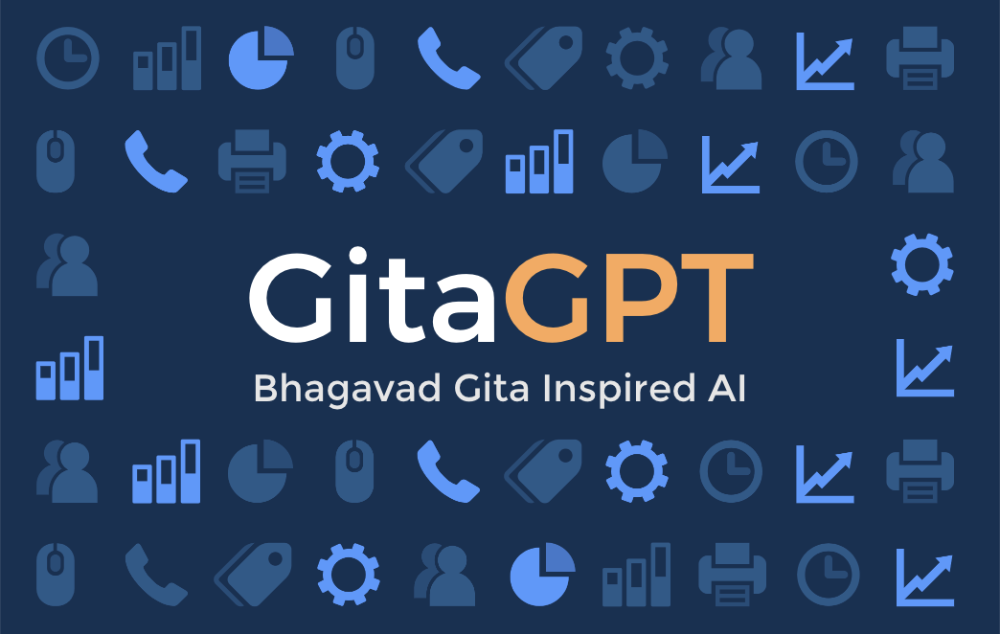

# Gita GPT - Unlock the Power of AI with Bhagavad Geeta

## What is GitaGPT?

GitaGPT is your virtual gateway to the teachings of Lord Krishna, as revealed in the Holy Bhagavad Gita. With GitaGPT, you can have a one-on-one conversation with Lord Krishna, asking for guidance and wisdom on life's challenges. Whether you're seeking a miracle to overcome a difficult situation, a powerful mantra to help you navigate daily life, or solutions to specific problems, GitaGPT is here to help.
With our advanced algorithms and intuitive interface, GitaGPT makes it easy to integrate powerful language capabilities into your applications and workflows.

With its advanced natural language processing capabilities, GitaGPT can understand your questions and provide insightful answers drawn from the timeless wisdom of the Bhagavad Gita. Whether you're a seasoned practitioner or just starting your spiritual journey, GitaGPT is the perfect tool for connecting with the divine and finding peace, purpose, and happiness in your life.

## Purpose of Bhagavad Gita AI

Vikas Sahu, a tech-geek entrepreneur, saw the potential of using AI to bring ancient wisdom and spirituality to a modern audience. With this vision in mind, he set out to create GitaGPT, a virtual platform that allows users to have a conversation with Lord Krishna and gain insight and guidance from the teachings of the Bhagavad Gita.

Utilizing cutting-edge AI technology, Vikas worked tirelessly to develop a system that could understand and respond to users' questions in a natural, intuitive way. The result of his efforts is GitaGPT, a revolutionary tool that is changing the way people connect with spirituality and seek answers to life's questions.

- With its accessible and user-friendly interface, GitaGPT is quickly becoming a popular resource for people from all walks of life, making it easier than ever to tap into the timeless wisdom of the Bhagavad Gita.
- GitaGPT project provide Online Bhagavad Gita with AI. Krishna Answer from Bhagavad Gita, which are the text of morality, strength, discipline and spirituality, so that friend Arjuna can be taken out of trouble.

## How works GitaGPT Chatbot

This project uses the [OpenAI GPT-3 API](https://openai.com/api/) (specifically, text-davinci-003) and [Vercel Edge functions](https://vercel.com/features/edge-functions) with streaming. It constructs a prompt based on the form and user input, sends it to the GPT-3 API via a Vercel Edge function, then streams the response back to the application.

Video and blog post coming soon on how to build apps with OpenAI and Vercel Edge functions!

if Gita Gpt not working, get touch with me on twitter @Gita_GPT

``

